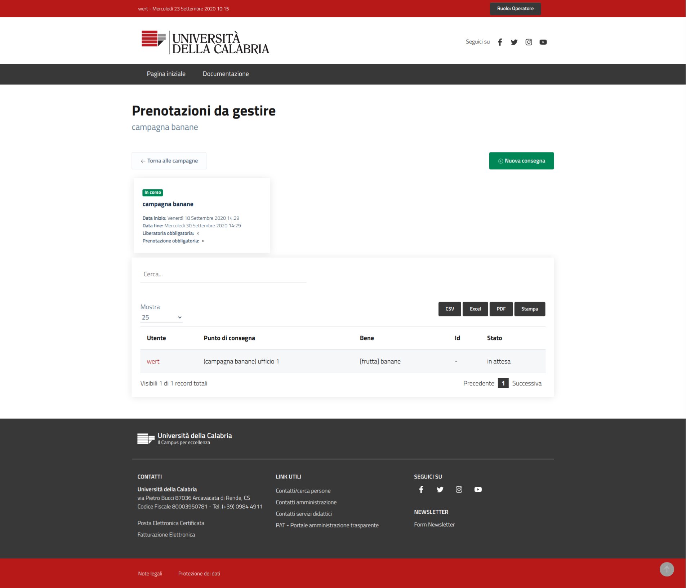
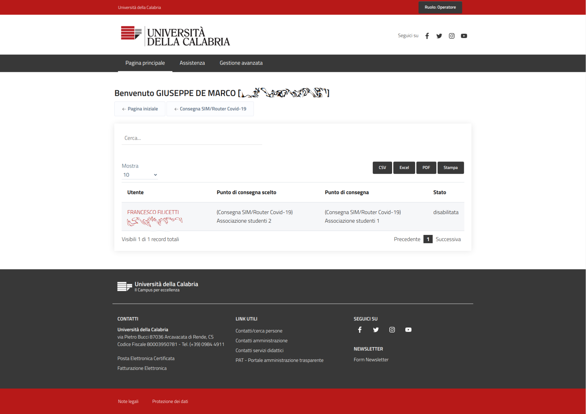
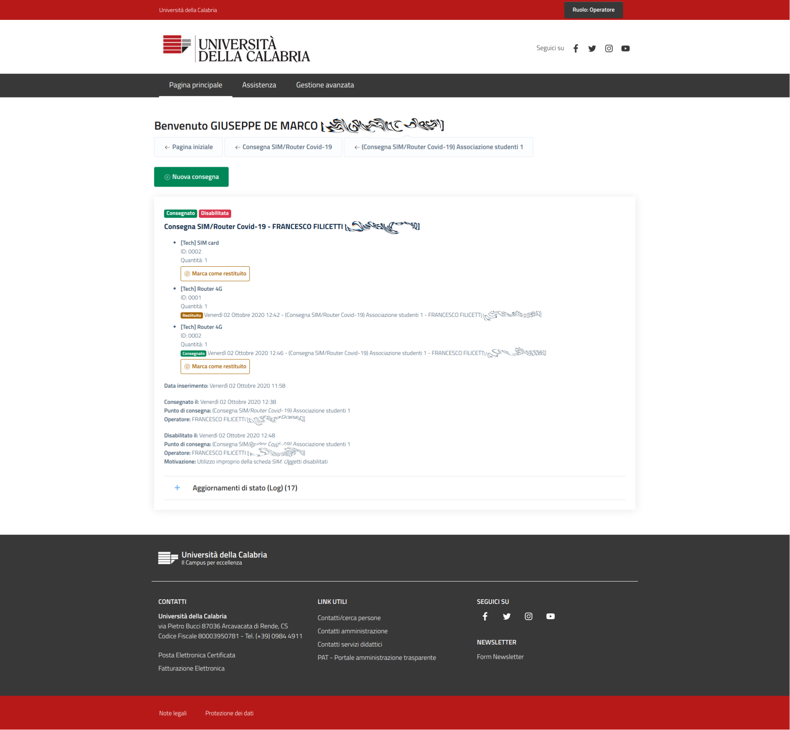

django-good-delivery
--------------------

A Django Framework app to manage delivery of goods in presence. This application was created to manage a valid list of users for the delivery of an asset, such as a sim card or a 4g router. This application can therefore manage a stock of uniquely identifiable products and at the same time serve for the delivery of anonymous goods, such as glasses of water or bananas (goods without any identificative value).

Delivery operations are organized through the definition of Campaigns, in a specific time interval.
Each campaign involves the activation of Delivery Points, which are assigned users with privilegesto manage the flow, called operators. Each campaign can show an Agreement text that the user is required to accept when collecting the goods, before the delivery can be intended as succesfully concluded.
A stock of available products is defined for each delivery point, each of which may or may not be identified by a code. Glass of water could not have a identification code, SIM card should instead.

Users entitled to collect the goods are associated with a single delivery point.

 
 
 

Management and flow description
-------------------------------

 Delivery campaign configuration (Django admin):
 
 - creation of a new delivery campaign (DeliveryCampaign);
 - definition of goods to be delivered (GoodCategory, Good);
 - definition of delivery points associated with the campaign (DeliveryPoint);
 - definition of stock of goods associated with delivery points (DeliveryPointGoodStock);
 - possible definition of lists of identification codes of goods associated with stocks (DeliveryPointGoodStockIdentifier);
 - operator user association for each delivery point (OperatorDeliveryPoint);

Flow of goods delivery operations in presence (step by step):

- [user] the user shows up at the delivery point associated with him;

* [operator] the operator carries out the recognition; 
* [operator] the operator accesses the web panel and selects the reference campaign;
* [operator] the operator identifies the user in the reserved list;
* [operator] the operator creates a new good delivery request;
* [operator] the operator selects the goods to be delivered and completes the dedicated form (possibly selecting the identification code from the list, if available);

- [user] if the campaign requires the user to confirm withdrawal, the latter receives a URL with an activation token and the text of the agreement, if any, on his e-mail. Upon clicking, the delivery operation is marked as completed and confirmed by the user. 
In the event of difficulty accessing their mailbox, the user can access the web platform and confirm the operation from the dedicated interface.
If even this option is not feasible by the user, the operator is required to eliminate the pending delivery request, advising the user to come back once the problems have been resolved;

* [operator] after confirming the user, the operator can deliver the goods.
In the event that the campaign does not provide for a user check, the operator can deliver the goods directly and independently mark the delivery as completed;
* [operator] each operator has the right to disable a delivery or request the return of an asset.


Demo project
------------

````
git clone https://github.com/UniversitaDellaCalabria/django-delivery.git
cd django-delivery
pip install -r requirements.txt

cd django_delivery
cp django_delivery/settingslocal.py.example django_delivery/settingslocal.py
./manage.py migrate
./manage.py createsuperuser
./manage.py runserver
````

Setup
-----

- Add good_delivery in settings.INSTALLED_APPS
- create your RSA keys
  ````openssl req -nodes -new -x509 -days 3650 -keyout private.key -out public.cert -subj '/CN=your.own.fqdn.com'````


Use cases and usage example
---------------------------

Todo

Tests
-----

````
./manage.py test good_delivery
````

coverage
````
pip install coverage
coverage erase
coverage run ./manage.py test good_delivery
coverage report -m
````
